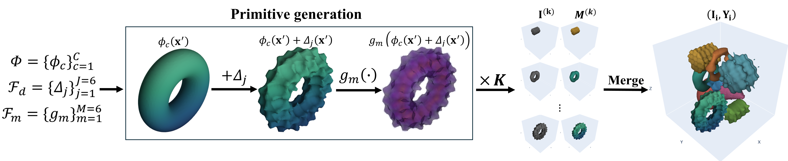

# FDIF: Formula-Driven Supervised Learning with Implicit Functions

Official implementation of **FDIF** (**F**ormula-**D**riven supervised learning with **I**mplicit **F**unctions), a framework that generates diverse synthetic labeled 3D volumes using signed distance functions (SDFs) for supervised pre-training in 3D medical image segmentation — **without using any real data**.

FDIF consistently outperforms both training from scratch and PrimGeoSeg across multiple segmentation benchmarks and architectures, achieving performance comparable to self-supervised methods that require large-scale real data.

<p align="center">
  
</p>
<p align="center"><b>Figure 1.</b> Overview of FDIF.</p>

## Installation

```bash
git clone https://github.com/yamanoko/FDIF.git
cd FDIF

# Install dependencies (uv package manager recommended)
uv pip install -r requirements.txt
# Or with standard pip
pip install -r requirements.txt
```

### Requirements

- Python 3.8+
- PyTorch 1.12+ with CUDA
- MONAI, nibabel, plotly, kaleido, numpy, tqdm, blosc2

---

## Quick Start

### 1. Generate Synthetic Dataset

To generate the dataset used in the paper, run with the following options:

```bash
python src/fdslxsdf4seg/generate_sdf_dataset.py \
    --out_dir ./pretraining_data \
    --D 96 --H 96 --W 96 \
    --num_samples 5000 \
    --min_objects 20 --max_objects 20 \
    --num_classes 109 \
    --sdf_mappers exponential_base_1.5 exponential_base_2.0 floor_width_0.5 floor_width_1.0 inverse_cube linear_slope_10.0 modular_10 modular_5 sinusoidal_wavelength_1.0 sinusoidal_wavelength_3.0 \
    --displacement_functions perlin_more_fine perlin_fine turbulence ridge ridge_coarse sharpmax sharpmax_fine twisted_x sawtooth \
    --mapper_as_augmentation \
    --displacement_as_augmentation
```

This generates 5,000 training samples at 96³ resolution using all 109 primitive classes, with 10 SDF mappers and 9 displacement functions applied as augmentation. Each sample contains 20 objects.

> **Note:** Running the script without these options uses much smaller defaults (64³ resolution, 200 samples, 2–5 objects, 4 primitives, 1 mapper, no displacement). The full option set above is required to reproduce the paper's configuration.

### 2. Pre-train a Model

```bash
python src/fdslxsdf4seg/training.py \
    --data_json_path ./pretraining_data/data/data.json \
    --model_name swin_unetr \
    --out_channel 110
```

`--out_channel` = number of classes + 1 (background). With 109 primitive classes, use `--out_channel 110`.

### 3. Fine-tune on Real Data

```bash
python src/fdslxsdf4seg/training.py \
    --data_json_path ./BTCV/dataset.json \
    --model_name swin_unetr \
    --is_real_data \
    --pretrained_model ./training_output/swin_unetr/model_best.pth \
    --pretraining_out_channel 110 \
    --out_channel 14
```

---

## Synthetic Data Generation

<p align="center">
  
</p>
<p align="center"><b>Figure 2.</b> Synthetic data generation pipeline of FDIF.</p>

### Paper Configuration

The paper uses the following configuration. **These options must be explicitly specified** — the script's built-in defaults are much smaller (see [Script Defaults](#script-defaults) below).

| Parameter | Paper Setting | Description |
|-----------|---------------|-------------|
| `--D`, `--H`, `--W` | 96 | Volume resolution |
| `--num_samples` | 5000 | Number of training samples |
| `--min_objects` / `--max_objects` | 20 / 20 | Objects placed per sample |
| `--num_classes` | 109 | Number of primitive classes (all available) |
| `--sdf_mappers` | 10 mappers | All available mappers (see below) |
| `--displacement_functions` | 9 displacements | All available displacements (see below) |
| `--mapper_as_augmentation` | Enabled | Mappers used as augmentation, not separate classes |
| `--displacement_as_augmentation` | Enabled | Displacements used as augmentation, not separate classes |

This configuration uses mappers and displacements as **augmentation** — they add visual diversity to the data but do not increase the class count. The resulting dataset has **109 classes + 1 background = 110 output channels**.

<details>
<summary>SDF mappers used in the paper (10)</summary>

`exponential_base_1.5`, `exponential_base_2.0`, `floor_width_0.5`, `floor_width_1.0`, `inverse_cube`, `linear_slope_10.0`, `modular_10`, `modular_5`, `sinusoidal_wavelength_1.0`, `sinusoidal_wavelength_3.0`

</details>

<details>
<summary>Displacement functions used in the paper (9)</summary>

`perlin_more_fine`, `perlin_fine`, `turbulence`, `ridge`, `ridge_coarse`, `sharpmax`, `sharpmax_fine`, `twisted_x`, `sawtooth`

</details>

### Script Defaults

Running the script without explicit options uses these minimal defaults:

| Parameter | Script Default | Paper Setting |
|-----------|---------------|---------------|
| `--D`, `--H`, `--W` | 64 | 96 |
| `--num_samples` | 200 | 5000 |
| `--min_objects` / `--max_objects` | 2 / 5 | 20 / 20 |
| `--primitives` | 4 (sphere, cylinder, torus, cone) | — |
| `--num_classes` | None | 109 |
| `--sdf_mappers` | None (inverse_cube only) | All 10 mappers |
| `--displacement_functions` | None (disabled) | All 9 displacements |
| `--mapper_as_augmentation` | Off | On |
| `--displacement_as_augmentation` | Off | On |

### Customizing Generation

#### Fewer Classes

```bash
python src/fdslxsdf4seg/generate_sdf_dataset.py \
    --out_dir ./small_dataset \
    --num_classes 10
```
Randomly selects 10 out of 109 primitive classes. → `--out_channel 11`

#### Specific Primitives

```bash
python src/fdslxsdf4seg/generate_sdf_dataset.py \
    --out_dir ./custom_dataset \
    --primitives sphere cylinder torus cone
```
→ 4 classes + background = `--out_channel 5`

#### By Category

```bash
python src/fdslxsdf4seg/generate_sdf_dataset.py \
    --out_dir ./category_dataset \
    --categories basic revolution
```

#### Mappers/Displacements as Separate Classes (Not Augmentation)

Without `--mapper_as_augmentation` / `--displacement_as_augmentation`, each combination of primitive × mapper (× displacement) becomes a distinct class:

```bash
python src/fdslxsdf4seg/generate_sdf_dataset.py \
    --out_dir ./hybrid_dataset \
    --primitives sphere cylinder torus \
    --sdf_mappers inverse_cube linear_slope_10.0 \
    --displacement_functions perlin_fine turbulence
```
→ (3 primitives × 2 mappers) + (3 primitives × 2 displacements × 2 mappers) = 6 + 12 = **18 classes** → `--out_channel 19`

#### Multi-Task Dataset

Generates separate label channels for shape, displacement, and mapper:

```bash
python src/fdslxsdf4seg/generate_sdf_dataset.py \
    --out_dir ./multi_task_dataset \
    --primitives sphere cylinder torus \
    --sdf_mappers inverse_cube linear_slope_10.0 \
    --displacement_functions perlin_fine turbulence \
    --multi_task
```

Cannot be combined with `--mapper_as_augmentation` or `--displacement_as_augmentation`.

#### nnUNet Format

```bash
python src/fdslxsdf4seg/generate_sdf_dataset.py \
    --out_dir ./outputs \
    --nnunet_format \
    --dataset_id 999 \
    --dataset_name SDFSynthetic
```
→ Creates `Dataset999_SDFSynthetic/` (training) and `Dataset1000_SDFSynthetic_Val/` (validation).

#### Validation Samples

```bash
python src/fdslxsdf4seg/generate_sdf_dataset.py \
    --out_dir ./dataset \
    --num_val_samples 1000
```

#### Visualization

```bash
python src/fdslxsdf4seg/generate_sdf_dataset.py \
    --out_dir ./dataset \
    --num_visualize 10
```

### All Generation Options

| Option | Script Default | Description |
|--------|---------------|-------------|
| `--out_dir` | Auto-generated | Output directory |
| `--D`, `--H`, `--W` | 64 | Volume grid size |
| `--num_samples` | 200 | Training samples |
| `--num_val_samples` | 0 | Validation samples |
| `--min_objects` / `--max_objects` | 2 / 5 | Objects per sample |
| `--num_classes` | None | Randomly select N classes from available primitives |
| `--primitives` | 4 basic shapes | Specific primitive names |
| `--categories` | — | Select by category (overrides `--primitives`) |
| `--sdf_mappers` | None (inverse_cube) | SDF mapper names |
| `--displacement_functions` | None (disabled) | Displacement function names |
| `--mapper_as_augmentation` | Off | Mappers as augmentation (no class increase) |
| `--displacement_as_augmentation` | Off | Displacements as augmentation (no class increase) |
| `--multi_task` | Off | Multi-task labels (shape/displacement/mapper) |
| `--nnunet_format` | Off | nnUNet output format |
| `--dataset_id` | 999 | Dataset ID for nnUNet format |
| `--seed` | None | Random seed |
| `--num_visualize` | 0 | Number of samples to visualize |

See [generate_sdf_dataset.md](generate_sdf_dataset.md) for full details.

---

## Classification Dataset Generation

Generate single-object volumes in Blosc2 format for 3D classification tasks:

```bash
python src/fdslxsdf4seg/generate_sdf_dataset_classification.py \
    --out_dir ./cls_dataset \
    --D 96 --H 96 --W 96 \
    --samples_per_class 50 \
    --primitives sphere cylinder torus cone \
    --sdf_mappers inverse_cube linear_slope_10.0 \
    --dataset_name my_sdf_classification
```
→ 4 primitives × 2 mappers = 8 classes × 50 samples = 400 total

See [SDF_CLASSIFICATION_DATASET.md](SDF_CLASSIFICATION_DATASET.md) for full details.

---

## Training

### Supported Models

| Model | Description | Memory |
|-------|-------------|--------|
| **VNet** | V-shaped 3D CNN | Low |
| **UNETR** | Vision Transformer + CNN decoder | Medium |
| **SwinUNETR** | Swin Transformer-based | High |

### Pre-training on Synthetic Data

```bash
python src/fdslxsdf4seg/training.py \
    --data_json_path ./pretraining_data/data/data.json \
    --model_name swin_unetr \
    --out_channel 110 \
    --max_iterations 30000
```

### Fine-tuning on Real Data

```bash
python src/fdslxsdf4seg/training.py \
    --data_json_path ./BTCV/dataset.json \
    --model_name swin_unetr \
    --is_real_data \
    --pretrained_model ./training_output/swin_unetr/model_best.pth \
    --pretraining_out_channel 110 \
    --out_channel 14 \
    --max_iterations 20000
```

### Multi-Task Training (UNETR/SwinUNETR only)

```bash
python src/fdslxsdf4seg/training.py \
    --data_json_path ./multi_task_dataset/data/data.json \
    --model_name swin_unetr \
    --multi_task
```
`--out_channel` is automatically determined from `data.json`.

### Training Options

| Option | Default | Description |
|--------|---------|-------------|
| `--data_json_path` | (required) | Path to dataset JSON |
| `--model_name` | (required) | `vnet`, `unetr`, or `swin_unetr` |
| `--out_channel` | 14 | Number of output channels (classes + background) |
| `--grid_size` | 96 96 96 | Input volume size |
| `--batch_size` | 1 | Batch size |
| `--max_iterations` | 30000 | Training iterations |
| `--learning_rate` | 1e-4 | Learning rate |
| `--pretrained_model` | — | Path to pre-trained model for fine-tuning |
| `--pretraining_out_channel` | 14 | Output channels of the pre-trained model |
| `--is_real_data` | Off | Use real data transforms |
| `--multi_task` | Off | Multi-task learning mode |
| `--gradient_accumulation_steps` | 1 | Gradient accumulation |
| `--use_checkpoint` | Off | Gradient checkpointing (reduces memory) |
| `--use_ce_loss` | Off | CrossEntropyLoss instead of DiceCELoss |

See [training.md](training.md) for full details.

---

## Output Formats

### MONAI Decathlon Format (Default)

```
output_directory/
├── generation_log.txt
├── data/
│   ├── data.json           # Dataset metadata
│   ├── image/              # Intensity volumes (.nii.gz)
│   └── label/              # Segmentation masks (.nii.gz)
└── visualizations/         # (if --num_visualize > 0)
```

### nnUNet Format

```
Dataset999_SDFSynthetic/
├── dataset.json
├── imagesTr/               # case_XXXXX_0000.nii.gz
├── labelsTr/               # case_XXXXX.nii.gz
└── generation_log.txt

Dataset1000_SDFSynthetic_Val/  # (if --num_val_samples > 0)
```

### Classification Format (Blosc2)

```
<data_root_dir>/
├── nnUNetResEncUNetLPlans_3d_fullres/
│   ├── case_00000.b2nd
│   └── ...
├── labelsTr.json
├── splits_final.json
├── <dataset_name>.yaml
└── generation_log.txt
```

---

## Visualization

```bash
# Visualize all primitives (2D slices)
python visualize_primitives.py

# 3D visualization of displaced primitives
python visualize_primitives.py --displaced --3d \
    --displaced_primitives Sphere Cylinder \
    --displacement_functions perlin_fine turbulence

# List available displacement functions
python visualize_primitives.py --list_displacements

# Primitive variation analysis
python visualize_primitives.py --variations \
    --variation_primitive Cylinder --num_variations 9
```

See [VISUALIZATION_README.md](VISUALIZATION_README.md) and [VARIATIONS_README.md](VARIATIONS_README.md) for details.

---

## Project Structure

```
FDSLxSDF4Seg/
├── src/fdslxsdf4seg/
│   ├── generate_sdf_dataset.py              # Segmentation dataset generation
│   ├── generate_sdf_dataset_classification.py  # Classification dataset generation
│   ├── training.py                          # Model training
│   ├── sdf_object.py                        # SDFObject base class
│   ├── basic_sdf.py                         # Basic primitives (Sphere, Torus, etc.)
│   ├── sdf_mapper.py                        # SDF → intensity mapping
│   ├── displacement_functions.py            # Surface deformation functions
│   ├── hybrid_primitive.py                  # Primitive × Mapper combinations
│   ├── displaced_primitive.py               # Primitive × Displacement combinations
│   ├── primitive_registry.py                # 109 primitives catalog
│   ├── sector_polygon_prism/               # Polygon prism variants
│   ├── star_polygon_prism/                 # Star polygon prism variants
│   ├── onioned_prism/                      # Multi-layered primitives
│   └── revolution/                         # Revolution shapes
├── outputs/                                 # Generated data
├── training_output/                        # Trained models
├── visualize_output/                       # Visualizations
├── paper_figures/                          # Paper figure scripts
└── BTCV/                                   # Real dataset (optional)
```
